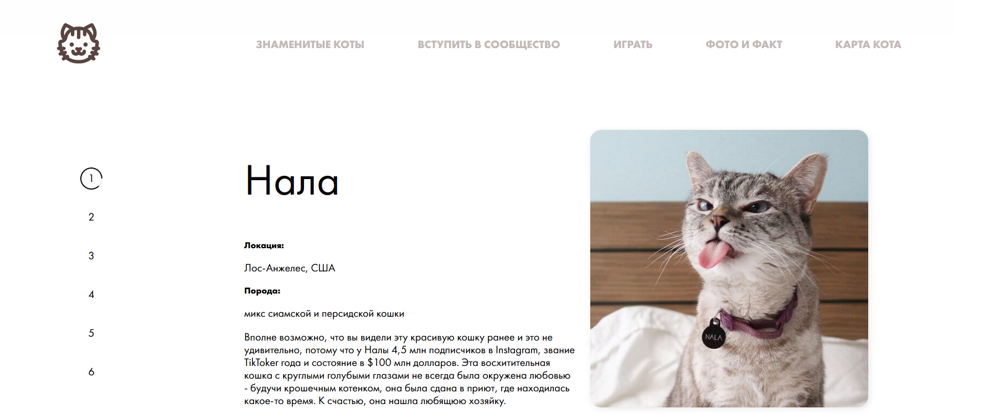

# Funny cats

## Description

A page for cat lovers that will cheer you up. Shows random facts about cats, makes you familiar with famous cats. Consists of 5 main blocks:

- Famous cats slideshow
- Registration form to join cat community
- Game: find a cat pair
- Random cat quote
- Guide to cat's anatomy

## How to use

Use top menu for navigation to blocks.

### Famous cats slideshow

🟠 Shows random famous cats' bio and location.

### Registration to join cat community

🟠 Allows to add your own cat to database by filling out the form.

### Game: find a cat pair

🟠 Find a pair for each cat shown on the card until all cards disappear. Get random cat gif if you win.

### Random cat quote

🟠 Get random opimistic quote and photo to brighten your day.

### Guide to cat's anatomy

🟠 Visualizes and explains most important cat parts.

## Technical details

✅ This website uses HTML, CSS and JavaScript including Flex for adaptive and functional interface.

✅ Sass preprocessor is used to make it easier to maintain the project.

✅ Website is hosted on GitHub Pages so that team can conveniently work on project together.

---

🔗 Find this website on GitHub Pages:
https://olgalosikova.github.io/js-team-project/
